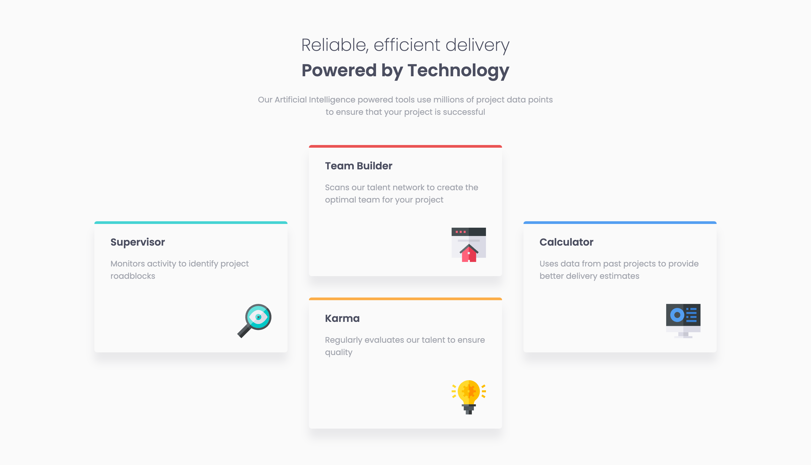

# Four card feature section
The aim for this challenge was to build out this QR code component and get it looking as close to the design as possible. This is a solution to the [Four card feature section coding challenge](https://www.frontendmentor.io/challenges/four-card-feature-section-weK1eFYK).

## Table of contents
- [Project screenshots](#project-screenshots)
- [Links](#links)
- [Built with](#built-with)
- [Author](#author)

## Project screenshots
Desktop size

Mobile size

## Links
* [Solution](https://github.com/agh911/Four-card-feature-section)
* [Live URL](https://agh911.github.io/Four-card-feature-section)

## Built with
- Semantic HTML5 markup
- CSS custom properties
- Flexbox

## Author
[@agh911](https://www.github.com/agh911)

